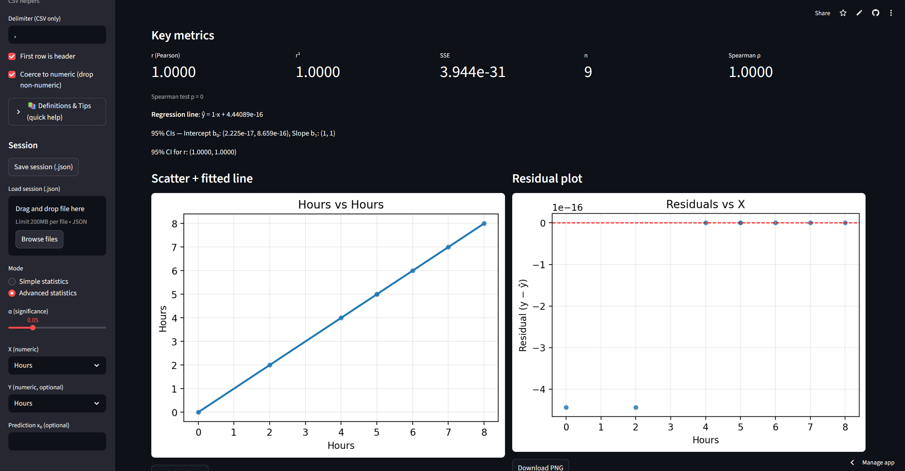

# 🧊 FrostNode | Statistics Toolset ⚡



A professional **statistics toolset** that stays **simple** but packs **advanced power**.  
Built with 🐍 **Python + Streamlit**, hosted free on **[Streamlit Cloud](https://frostnode-statisticstoolset.streamlit.app/)**.  

Two modes, intuitive UI, one-click exports. 🔥  

---

## ✨ Features
- 📦 **Download-All ZIP** → charts + tables + summary
- 📚 **Definitions & Tips panel** → quick reference
- 🧾 **Auto-narratives** → histogram shape, regression conclusions, CI interpretations
- 🔧 **Import helpers** → delimiter, header toggle, coerce-to-numeric, drop log
- 🔍 **Assumption checks** → Q-Q plot, Shapiro–Wilk, Breusch–Pagan hint
- 🔄 **Transform toggles** → log(y), log(x), both; auto back-prediction
- 📈 **Correlation** → Pearson + Spearman (with CI for r via Fisher z)
- 🧮 **Excel extras** → formula sheet (.txt) with absolute range option
- 💾 **Exports** → Excel, Word, PowerPoint, or one-click ZIP
- 💡 **Save/Load session** → JSON snapshot of your work

---

## 🚀 Run locally
```bash
# create & activate venv
python -m venv .venv
# Windows: .venv\Scripts\activate
# macOS/Linux: source .venv/bin/activate

# install deps
pip install -r requirements.txt

# launch the app
streamlit run app_streamlit.py
